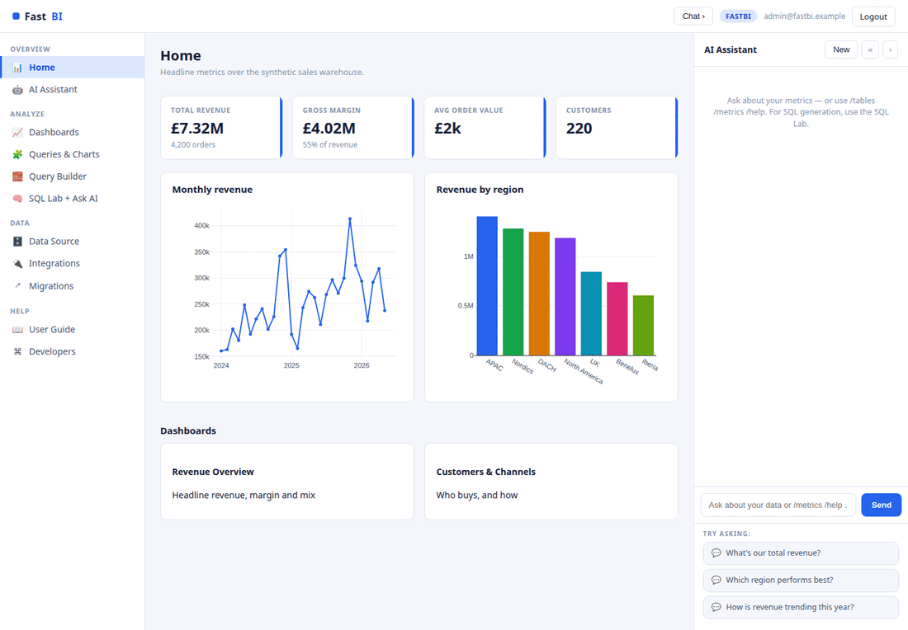

# FastBI

Current release: **0.2.0**. See [docs/change_log.md](docs/change_log.md).

**FastBI** is an open-source **business-intelligence tool** built with
[FastHTML](https://fastht.ml) — a server-side, HTMX-driven port of the core of
[Frappe Insights](https://github.com/frappe/insights). Python-first, no
JavaScript framework: a synthetic data warehouse, saved queries that render
**Plotly** charts, dashboards, SQL and Cypher labs, and a conversational AI
assistant that routes questions to **text-to-SQL** or **text-to-Cypher**.

Live at **[fastbi.org](https://fastbi.org)**.

*Ask your data anything.* Runs on port **5008**.

> **Synthetic data only.** Everything runs on a deterministic, fully synthetic
> retail sales warehouse generated by `seed.py`.

## Demo



Captured views: [desktop landing](docs/screenshots/fastbi-landing.png),
[mobile landing](docs/screenshots/fastbi-landing-mobile.png), and
[integrations and migrations](docs/screenshots/fastbi-integrations.png).

## Quickstart (native)

```bash
python -m venv .venv
.venv/bin/python -m pip install -r requirements.txt
cp .env.sample .env          # add an LLM key to enable AI text-to-SQL
.venv/bin/python web_app.py  # http://localhost:5008  (self-seeds on first boot)
```

Set `FASTBI_ADMIN_EMAIL` and `FASTBI_ADMIN_PASSWORD` in the ignored `.env` for
local password sign-in, or configure Google SSO. Rebuild the warehouse with
`.venv/bin/python seed.py`.

## Run with Docker

```bash
docker compose up --build      # http://localhost:5008
```

`Dockerfile` (python:3.12-slim, port 5008) seeds on first boot.
`docker-compose.yml` mounts FastBI data at `/data` and starts the optional
Neo4j 5.26 secondary store. Neo4j Browser and Bolt are bound to localhost at
`http://127.0.0.1:7474` and `bolt://127.0.0.1:7687`; change the development
password before exposing either port.

## Module tour

- **Home** (`/`) — KPI cards (revenue, margin, AOV, customers) + two flagship
  Plotly charts + dashboard links.
- **Dashboards** (`/dashboards`) — curated boards of charts in a responsive grid.
- **Queries & Charts** (`/queries`) — saved SQL queries, each bound to a chart
  type; open one for the chart, the SQL, and the result table.
- **SQL Lab + Ask AI** (`/sql`) — run **read-only** SQL against the warehouse,
  **or** describe what you want in plain English and the AI writes the SQL, runs
  it, and charts the result. The schema is shown alongside.
- **Data Source** (`/sources`) — browse the warehouse tables with row counts and
  samples.
- **Integrations** (`/integrations`) — pull a bounded public schema or catalogue
  endpoint for Microsoft Fabric/OneLake, BigQuery, Redshift, Snowflake,
  Databricks, or a major SQL database.
- **Migrations** (`/migrations`) — upload Power BI, Tableau, Looker, report
  definition, PDF, or screenshot artefacts and generate an editable dashboard
  grounded in a selected schema. With `XAI_API_KEY` configured, PNG/JPEG report
  screenshots are interpreted by the multimodal model before generation.
- **Ontologies** (`/ontologies`) — administrators validate, preview, apply, and
  roll back versioned JSON/YAML property-graph imports.
- **Graph Explorer** (`/graph`) — interactive ontology visualisation with node
  inspection and per-ontology filtering.
- **Cypher Lab + Ask AI** (`/cypher`) — execute bounded read-only Cypher or turn
  a relationship question into guarded Cypher and an interactive graph.
- **AI Assistant** (right rail) — automatic SQL/Graph routing by default, with
  explicit Auto, SQL, and Graph controls. Slash-commands `/metrics`, `/tables`,
  and `/top` work with **no API key**.

## AI text-to-SQL (the showcase)

The SQL Lab's *Ask the data* box sends your question plus the live warehouse
schema to the configured LLM, which returns a single SQL query. That query is
run through `db.run_sql()` — which **enforces a single read-only `SELECT`**
(no INSERT/UPDATE/DELETE/DDL, single statement) — and the result is rendered as
a chart and table. The model never touches the database directly.

```ini
MODEL_PROVIDER=xai          # xai | openai | anthropic | google
MODEL_NAME=grok-4.5
XAI_API_KEY=...
```

Without a key, dashboards, saved queries, the SQL lab, and slash-commands all
still work — only AI generation is disabled.

## Architecture

```
web_app.py        routes, auth, SQL-run + AI-SQL endpoints, SSE chat, boot
db.py             warehouse + app schema, read-only run_sql() guard
graph_db.py       optional Neo4j connection, ontology import, Cypher guard
seed.py           synthetic retail star schema + saved queries/charts/dashboards
web/charts.py     Plotly chart + result-table rendering
web/layout.py     3-pane shell, CSS, chat JS
web/views.py      page renderers
web/integrations.py  schema import and report migration workflows
web/graph_views.py   ontology, graph explorer, and Cypher UI
web/graph_ai.py      schema-grounded text-to-Cypher
web/ai.py         grounded chat, routing, text-to-SQL and text-to-Cypher
rag.py            pgvector, FAISS, Neo4j GraphRAG, ingestion and comparative evals
web/rag_views.py  GraphRAG chat and evaluation workspace
```

See **[SKILLS.md](SKILLS.md)** for the capability reference + migration playbook,
**[docs/GRAPH_DB.md](docs/GRAPH_DB.md)** for the graph contract and deployment
runbook, and **[docs/ROADMAP.md](docs/ROADMAP.md)** for the comparison vs Frappe Insights.

## Licence

MIT. Part of the
[`fasthtml-oss-migrations`](https://github.com/predictivelabsai/fasthtml-oss-migrations)
initiative.
