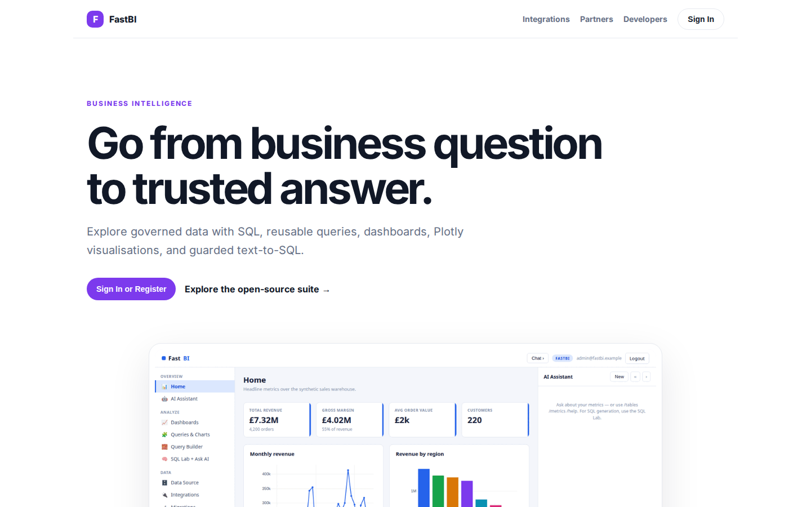
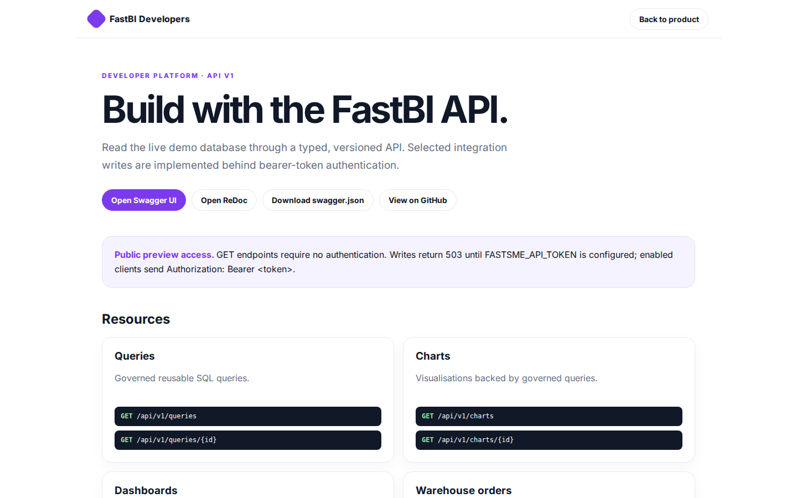
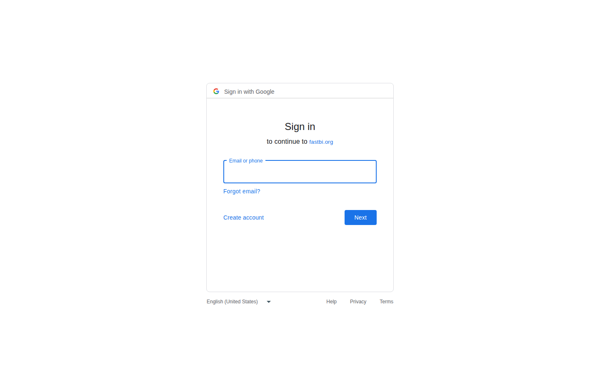
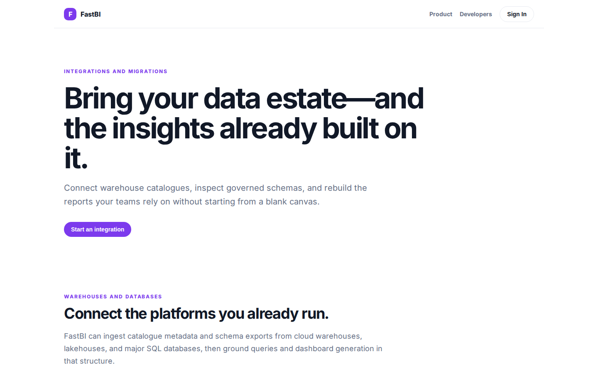

# FastBI Platform Guide

**Published:** 2026-08-19
**Platform:** [https://fastbi.org](https://fastbi.org)
**Source:** [github.com/predictivelabsai/FastBI](https://github.com/predictivelabsai/FastBI)

## Platform overview

**FastBI** is an open-source **business-intelligence tool** built with — a server-side, HTMX-driven port of the core of . Python-first, no JavaScript framework: a synthetic data warehouse, saved queries that render **Plotly** charts, dashboards, SQL and Cypher labs, and a conversational AI assistant that routes questio

This visual guide was reviewed against the live product using Playwright. Screens and available navigation can vary by account, role, and deployment configuration.

## 1. Go from business question to trusted answer.

BUSINESS INTELLIGENCE Go from business question to trusted answer. Explore governed data with SQL, reusable queries, dashboards, Plotly visualisations, and guarded text-to-SQL. Sign In or Register Explore the open-source suite → Product tour · see the workspac

Screen reviewed at: [https://fastbi.org/](https://fastbi.org/)

## 2. Build with the FastBI API.

FastBI Developers Back to product DEVELOPER PLATFORM · API V1 Build with the FastBI API. Read the live demo database through a typed, versioned API. Selected integration writes are implemented behind bearer-token authentication. Open Swagger UI Open ReDoc Down

Screen reviewed at: [https://fastbi.org/developers](https://fastbi.org/developers)

## 3. Sign in

Sign in with Google Sign in to continue to fastbi.org Email or phone Forgot email? Next Create account Afrikaans azərbaycan bosanski català Čeština Cymraeg Dansk Deutsch eesti English (United Kingdom) English (United States) Español (España) Español (Latinoamé

Screen reviewed at: [https://accounts.google.com/v3/signin/identifier?opparams=%253F&dsh=S-1574222964%3A1787122621960752&access_type=online&client_id=887059023987-2a7spj1m82eivobdbt1itb3cqca6tpt1.apps.googleusercontent.com&o2v=2&prompt=select_account&redirect_uri=https%3A%2F%2Ffastbi.org%2Fauth%2Fgoogle%2Fcallback&response_type=code&scope=openid+email+profile&service=lso&state=zY3Oon4ctJ-OFOd1uES8KbvIoSRH0qzi-C0-FG9LthI&flowName=GeneralOAuthLite&continue=https%3A%2F%2Faccounts.google.com%2Fsignin%2Foauth%2Flegacy%2Fconsent%3Fauthuser%3Dunknown%26part%3DAJi8hAPH4n7sir8Rxac81oguSU-yz3q-EpUCC_xety6BQbx8kYhU2O47uuh5mWw1x6P2coMzGhlGWSiYZUGAH4xmJVuGeUDGoCkaD1iYlGrcaNK_M60AgVVNm-qEXyRHJUXlvOY4vrDJY5csK5B_NQI4DuibXRll24-y7UdnY9wOwuYUEiRocfo99qdK8WTTCcDGtMc_qXg01gaPfLDrL3vc1eg6R2AeXn2711_rzT77UEWwII5G7V83-7AYUp_GU8DFGoH4lvd8BeJ4769ZJXDa1q5-Vfbhw-5R0M_ASo6rni3T7BOYJ7_XPsBZ8dkjM2BGg6FLQrcIh9mtRrdWR4k3izpBD97wmAfrzRK6VDQ34XIaFL_QzWCGDBE2bnThHewNdrzS7BnyJ_uO-lwjgRxYJD4lTFD4hLQqWoEEuRIov5yjowBVqhLGHmn9q1uIwSBUv35W26vi_VbxCjn58xKjAWGb7If8Sw%26flowName%3DGeneralOAuthFlow%26as%3DS-1574222964%253A1787122621960752%26client_id%3D887059023987-2a7spj1m82eivobdbt1itb3cqca6tpt1.apps.googleusercontent.com%23&app_domain=https%3A%2F%2Ffastbi.org&rart=ANgoxcfMQQlxh-XwwMHZrBUPOut94I_Pocnvf3hisTReu3XpqLvHlUWUZeUqXjic3fo2kGnDbbnaJ10FOt_m0bKfxaZRN1RhdXxtSgQQbjAN3myD2JkCsAc](https://accounts.google.com/v3/signin/identifier?opparams=%253F&dsh=S-1574222964%3A1787122621960752&access_type=online&client_id=887059023987-2a7spj1m82eivobdbt1itb3cqca6tpt1.apps.googleusercontent.com&o2v=2&prompt=select_account&redirect_uri=https%3A%2F%2Ffastbi.org%2Fauth%2Fgoogle%2Fcallback&response_type=code&scope=openid+email+profile&service=lso&state=zY3Oon4ctJ-OFOd1uES8KbvIoSRH0qzi-C0-FG9LthI&flowName=GeneralOAuthLite&continue=https%3A%2F%2Faccounts.google.com%2Fsignin%2Foauth%2Flegacy%2Fconsent%3Fauthuser%3Dunknown%26part%3DAJi8hAPH4n7sir8Rxac81oguSU-yz3q-EpUCC_xety6BQbx8kYhU2O47uuh5mWw1x6P2coMzGhlGWSiYZUGAH4xmJVuGeUDGoCkaD1iYlGrcaNK_M60AgVVNm-qEXyRHJUXlvOY4vrDJY5csK5B_NQI4DuibXRll24-y7UdnY9wOwuYUEiRocfo99qdK8WTTCcDGtMc_qXg01gaPfLDrL3vc1eg6R2AeXn2711_rzT77UEWwII5G7V83-7AYUp_GU8DFGoH4lvd8BeJ4769ZJXDa1q5-Vfbhw-5R0M_ASo6rni3T7BOYJ7_XPsBZ8dkjM2BGg6FLQrcIh9mtRrdWR4k3izpBD97wmAfrzRK6VDQ34XIaFL_QzWCGDBE2bnThHewNdrzS7BnyJ_uO-lwjgRxYJD4lTFD4hLQqWoEEuRIov5yjowBVqhLGHmn9q1uIwSBUv35W26vi_VbxCjn58xKjAWGb7If8Sw%26flowName%3DGeneralOAuthFlow%26as%3DS-1574222964%253A1787122621960752%26client_id%3D887059023987-2a7spj1m82eivobdbt1itb3cqca6tpt1.apps.googleusercontent.com%23&app_domain=https%3A%2F%2Ffastbi.org&rart=ANgoxcfMQQlxh-XwwMHZrBUPOut94I_Pocnvf3hisTReu3XpqLvHlUWUZeUqXjic3fo2kGnDbbnaJ10FOt_m0bKfxaZRN1RhdXxtSgQQbjAN3myD2JkCsAc)

## 4. Bring your data estate—and the insights already built on it.

INTEGRATIONS AND MIGRATIONS Bring your data estate—and the insights already built on it. Connect warehouse catalogues, inspect governed schemas, and rebuild the reports your teams rely on without starting from a blank canvas. Start an integration WAREHOUSES AN

Screen reviewed at: [https://fastbi.org/integrations](https://fastbi.org/integrations)

## Getting started

Visit [https://fastbi.org](https://fastbi.org) to explore FastBI. For source code and deployment details, use the GitHub link above.
